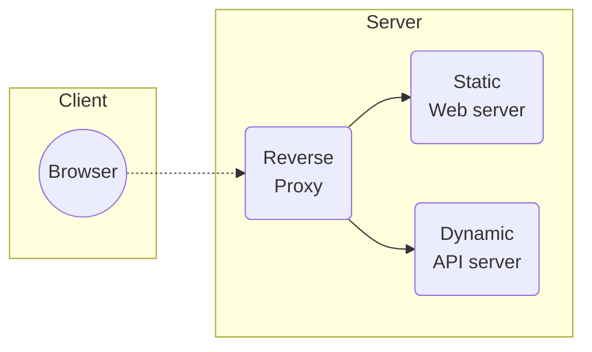
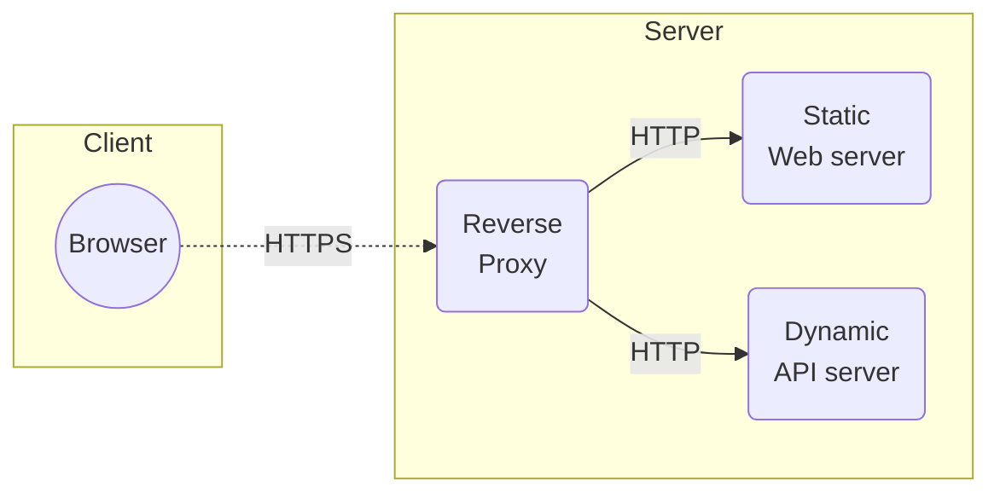

DAI Lab - HTTP infrastructure
=============================


Student:

- Jeffrey Mvutu Mabilama
- Adrien Marcuard


## REPORT

You may refer to the full instructions of the project [here](instructions.md).


------


## Instructions of the lab (for reference). Can be ¥deleted


Objectives
----------

The main objective of this lab is to learn to build a complete Web infrastructure. This means, we will build a server infrastructure that serves a static Web site and a dynamic HTTP API. The diagram below shows the architecture of the infrastructure that we will build.



In addition to the basic requirement of service static and dynamic content, the infrastructure will have the following features:

- **Scalability**: both the static and the dynamic server will be deployed as a cluster of several instances. The reverse proxy will be configured to distribute the load among the instances.
- **Security**: the connection between the browser and the reverse proxy will be encrypted using HTTPS.
- **Management**: a Web application will be deployed to manage the infrastructure. This application will allow to start/stop instances of the servers and to monitor the state of the infrastructure.


Step 0: GitHub repository
-------------------------

We have created a repo containing our project.


The project is structured as such:

- `docker-compose.yml`

- `webapp-static/`
  - static web app with some javascript.
- `web-api/`
  - API of our task management service.
- Management of reverse proxy:
  - `traefik-certificates` : certificates for
  - `portainer-data`


#### Preview the complete project

To start the project and have a first look:

Launch our setup with the following command at the root of the repo while Docker Desktop is running.

`docker-compose up --build -d`

(Please note the "--build" in the command).


After Docker has finished preparing the environment, visit:

- the webapp at [https://localhost/](https://localhost/) (please note httpS).
- the API : [https://localhost/api/task](https://localhost/api/task) (example endpoint of our API)


## Description


### Acceptance criteria

- [x] You have created a GitHub repository for your project.
- [x] The respository contains a Readme file that you will use to document your project.


Step 1: Static Web site
-----------------------

The goal of this step is to build a Docker image that contains a static HTTP server Nginx. The server will serve a static Web site. The static Web site will be a single page with a nice looking template. You can use a free template for example from [Free-CSS](https://www.free-css.com/free-css-templates) or [Start Bootstrap](https://startbootstrap.com/themes).

Creation of a static website (HTML, CSS, Javascript) served with a Nginx server.

The site must be accessible from a web browser.


Configuration of the `nginx.conf` file:

```web-idl
server {
    listen 80; #< public port that nginx will listen to. a client browser must connect to this port in a standard setup.

    # Serve the frontend files
    root /usr/share/nginx/html; #< where the files are stored
    index index.html; #< default file to serve when the URL does not designated a file.

    # Redirect API requests to the backend
    location /api/ {
        proxy_pass http://apibackend:7070; # Nom du service Docker backend
        proxy_set_header Host $host;
        proxy_set_header X-Real-IP $remote_addr;
        proxy_set_header X-Forwarded-For $proxy_add_x_forwarded_for;
    }

    # Fallback to index.html for SPA (Vue.js)
    location / {
        try_files $uri /index.html;
    }
}

```


This file as well as our static web app are copied into an image using the instructions of the `Dockerfile`  at the build time of the image.


**Tests**:

- In the directory of the web app, run the docker command to launch the dockerfile file.
- We tested the website by visiting the https://localhost:\<port_number> with a web browser.
  - first we tested our configuration with a 8090 port (in the docker files).
  - then we changed back the port in the docker files for the final review. (the port will be modified later in the project).

- When visiting the address, the site is displayed correctly.


### Acceptance criteria

- [x] You have created a separate folder in your respository for your static Web server.
- [x] You have a Dockerfile based on the Nginx image. The Dockerfile copies the static site content into the image.
- [x] You have configured the `nginx.conf` configuration file to serve the static content on a port (normally 80).
- [x] You are able to explain the content of the `nginx.conf` file.
- [x] You can run the image and access the static content from a browser.
- [x] You have **documented** your configuration in your report.


Step 2: Docker compose
----------------------

The goal of this step is to use Docker compose to deploy a first version of the infrastructure with a single service: the static Web server.

In addition to the basic docker compose configuration, we want to be able to rebuild the docker image of the Web server. See the [Docker compose Build documentation](https://docs.docker.com/compose/compose-file/build/) for this part.


We added a `docker-compose.yml` file to automate the build process of our static web app. using `docker-compose --build -d` the image of the static website is rebuilt, and the new files are served to  browsers upon visit--.


Tests:

- test the access of the website (that nothing got broken since last step)
- test that nothing changed in the way of access from a user's perspective.
- we modified the HTML of some files, ran `docker compose build` , and saw the changed content on the web page


### Acceptance criteria

- [x] You have added a docker compose configuration file to your GitHub repo.
- [x] You can start and stop an infrastructure with a single static Web server using docker compose.
- [x] You can access the Web server on your local machine on the respective port.
- [x] You can rebuild the docker image with `docker compose build`
- [x] You have **documented** your configuration in your report.


Step 3: HTTP API server
-----------------------

The goal is to build a HTTP API with Javalin. The API we implemented is a task management API.

The requirement is that the API supports at all CRUD operations, i.e.: Create, Read, Update, Delete. 

We used Hoppscotch to test all these operations.


**The code base**

For more details, see [the readme.md](web-api/src/readme.md) file in `web-api/src/readme.md`.

In short, the Javalin codebase uses the same architecture as we used in the course and in labs. And the following files are also used:

- `hoppscotch-tests-task.json` contains the API test requests.
- in the `src/pom.xml` file contains maven build instructions.


**Tests**

- Tested that the API is available on port 7070. (http://localhost:7070/api/task)
- Tested the API using hoppscotch in a java IDE. it worked (the endpoints work as they should regarding CRUD operations)
  - check with breakpoints to see deletions.
- then we deployed to the container and tested with the same API testing tool. it worked.
  - check that tasks are returned/created/deleted/updated as they should.
- Check that the API has its own port and can be accessed on a different port of `localhost` than the static server. Tested that the API is available on port 7070. (http://localhost:7070/api/task)
- Test that rebuilding the image works (changing a task detail in the code is a reflected in the browser with the `/api/task` (get all tasks) GET endpoint)


### Acceptance criteria

- [x] Your API supports all CRUD operations.
- [x] You are able to explain your implementation and walk us through the code.
- [x] You can start and stop the API server using docker compose.
- [x] You can access both the API and the static server from your browser.
- [x] You can rebuild the docker image with docker compose.
- [x] You can do demo where use an API testing tool to show that all CRUD operations work.
- [x] You have **documented** your implementation in your report.


 


Step 4: Reverse proxy with Traefik
----------------------------------

The goal of this step is to place a reverse proxy in front of the dynamic and static Web servers such that the reverse proxy receives all connections and relays them to the respective Web server. 

- you will have to remove the `ports` configuration from the static and dynamic server in the docker compose file and replace them with `expose` configuration. Traefik will then be able to access the servers through the internal Docker network.

- You can use the [Traefik dashboard](https://doc.traefik.io/traefik/operations/dashboard/) to monitor the state of the reverse proxy.


**Tests**

- Browse the [http://localhost:8080/](http://localhost/:8080) endpoint and we see the traefik dashboard
- Check on the traefik dashboard that the routing seems functional
- Navigate to [http://localhost/](http://localhost/) on a browser. Test that we see the static web app page.
- Navigate to http://localhost/api/task on a browser. Test that we see the API result.


### Acceptance criteria

- [x] You can do a demo where you start from an "empty" Docker environment (no container running) and using docker compose you can start your infrastructure with 3 containers: static server, dynamic server and reverse proxy
- [x] In the demo you can access each server from the browser in the demo. You can prove that the routing is done correctly through the reverse proxy.
- [x] You are able to explain how you have implemented the solution and walk us through the configuration and the code.
- [x] You are able to explain why a reverse proxy is useful to improve the security of the infrastructure.
- [x] You are able to explain how to access the dashboard of Traefik and how it works.
- [x] You have **documented** your configuration in your report.


Step 5: Scalability and load balancing
--------------------------------------

The goal of this section is to allow Traefik to dynamically detect several instances of the (dynamic/static) Web servers. You may have already done this in the previous step 3.

We modified our docker compose file such that several instances of each server are started. 


Then, find a way to *dynamically* update the number of instances of each service with docker compose, without having to stop and restart the topology.

- use the following command in the root of the repo to adjust the number of server of each component: `docker compose up --scale webapp=N apibackend=K -d`
  - docker will adjust (stop or create) server instances.


**Tests**

We tested the scaling command and it worked. traefik dashboard showed the updated number of instances.


### Acceptance criteria

- [ ] You can use docker compose to start the infrastructure with several instances of each server (static and dynamic).
- [ ] You can dynamically add and remove instances of each server.
- [ ] You can do a demo to show that Traefik performs load balancing among the instances.
- [ ] If you add or remove instances, you can show that the load balancer is dynamically updated to use the available instances.
- [ ] You have **documented** your configuration in your report.


Step 6: Load balancing with round-robin and sticky sessions
-----------------------------------------------------------

By default, Traefik uses round-robin to distribute the load among all available instances. However, if a service is stateful, it would be better to send requests of the same session always to the same instance. This is called sticky sessions.

The goal of this step is to change the configuration such that:

- Traefik uses sticky session for the dynamic server instances (API service).
- Traefik continues to use round robin for the static servers (no change required).


**Tests**

- Testing sticky session:
  - Open the developer tools of a web browser like firefox in normal navigation and in private browsing. Go to network tab of the developer tools.
    Browse a endpoint of the API and
    - (if first time accessing the API) check that the response reveived contains a "set-cookie" header with value `sticky-cookie=....`
    - otherwise look at the  "cookie" of the sent request. there is a `sticky-cookie=...` cookie value
    - check that each window (the private browsing window, and the normal) keeps the same value for the `sticky-cookie`
  - 


### Acceptance criteria

- [ ] You do a setup to demonstrate the notion of sticky session.
- [ ] You prove that your load balancer can distribute HTTP requests in a round-robin fashion to the static server nodes (because there is no state).
- [ ] You prove that your load balancer can handle sticky sessions when forwarding HTTP requests to the dynamic server nodes.
- [ ] You have **documented** your configuration and your validation procedure in your report.


Step 7: Securing Traefik with HTTPS
-----------------------------------

Any real-world web infrastructure must be secured with HTTPS instead of clear-text HTTP. The goal of this step is to configure Traefik to use HTTPS with the clients. The schema below shows the architecture.



This means that HTTPS is used for connection with clients, over the Internet.


### Certificate


### Activating the HTTPS entrypoint for the servers

Finally, you have to activate HTTPS for the static and dynamic servers. This is done in the docker compose file. You have to add two labels to each server:

- to activate the HTTPS entrypoint,
- to set TLS to true.

See the [Traefik documentation for Docker](https://doc.traefik.io/traefik/routing/providers/docker/#routers) for these two labels.

### Testing

After these configurations it should be possible to access the static and the dynamic servers through HTTPS. The browser will complain that the sites are not secure, since the certificate is self-signed. But you can ignore this warning.


we visited with a browser:

- the webapp at [https://localhost/](https://localhost/) (please note httpS).
- the API : [https://localhost/api/task](https://localhost/api/task) (example endpoint of our API)
- Everything is working as before, but in HTTPS


### Acceptance criteria

- [x] You can do a demo where you show that the static and dynamic servers are accessible through HTTPS.
- [x] You have **documented** your configuration in your report.


Optional step 2: Integration API - static Web site
--------------------------------------------------

The goal of this step is to change the static Web page to a page that fetches data from the API server to simulate real world web apps.


**Test**

- The "Task" page of our static web app displays the list of tasks from the API server


### Acceptance criteria

- [x] You have added JavaScript code to your static Web page to make at least a GET request to the API server.
- [x] You can do a demo where you show that the API is called and the result is displayed on the page.
- [x] You have **documented** your implementation in your report.


Optional steps implemented
==============


Optional step 1: Management 
------------------------------

The goal of this step is to deploy or develop a Web app that can be used to monitor and update your Web infrastructure dynamically. You should be able to list running containers, start/stop them and add/remove instances.

- you use an existing solution (search on Google)
- for extra points, develop your own Web app. In this case, you can use the Dockerode npm module (or another Docker client library, in any of the supported languages) to access the docker API.

### Acceptance criteria

- [ ] You can do a demo to show the Management UI and manage the containers of your infrastructure.
- [ ] You have **documented** how to use your solution.
- [ ] You have **documented** your configuration in your report.

- [ ] 

